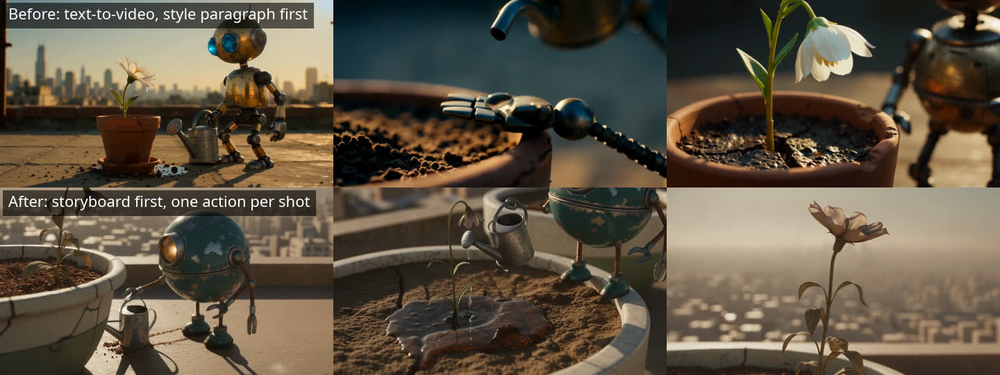
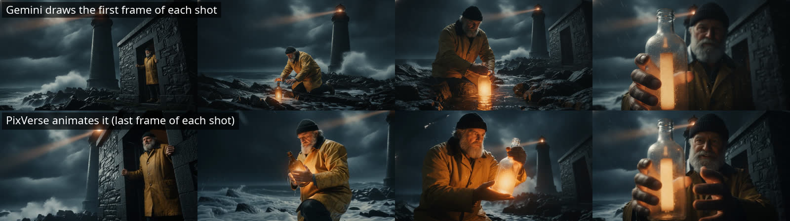

# Director's Cut

**Describe a film. An LLM director (Claude, GPT-6 or an open-weight model) writes it, Gemini draws a storyboard from character sheets, the director checks every frame, and PixVerse animates each one with its own sound. You get the edit in about two minutes.**

```
premise → the director writes the film: a cast (one fixed look each), a world (place, time, light), and N shots
          (first frame, one action, one camera move, sound, length)
        → Gemini draws a reference sheet per character, then the first frame of every shot from those sheets
        → the director looks at the storyboard and has any frame with a defect redrawn, once
        → PixVerse animates every frame with native audio (image-to-video), or one multi-shot take from the first frame
        → ffmpeg levels the sound, cuts the shots together behind a title card → reshoot any shot with a new note
```



| At a glance | |
|---|---|
| Providers | Director: Claude, GPT-6, Kimi K3, GLM 5.3 or DeepSeek V4 Pro. Storyboard: Gemini 2.5 Flash Image. Camera: PixVerse V6 or C1 |
| One film | 4 shots, about 19 s, 720p with sound: about 2 min and $1.18 (3 shots: about $0.94). A reshoot takes about 1 min and costs $0.24–0.28 |
| Runs as | A local web page (FastAPI plus one HTML file) |
| Eden AI endpoints | `/v3/chat/completions` (JSON schema, image input), `/v3/universal-ai` (image generation), `/v3/universal-ai/async` (video), `/v3/upload` |

## Why these providers

| Step | Provider, via Eden AI | Why it's a great fit here |
|---|---|---|
| Direct | **Claude** `anthropic/claude-sonnet-latest` | Directing is a writing job, and Claude's structured output returns the whole film as one strict JSON plan: the cast, the world, and every shot's frame, action, camera move and sound. About 18 s and $0.02. Seven other directors are one dropdown away (below). |
| Draw | **Gemini 2.5 Flash Image** `image/generation/google/gemini-2.5-flash-image` | It takes reference images, so every frame is drawn from the same character sheet: the keeper keeps his beard, cap and yellow oilskin in all four shots. It draws a 16:9 frame in 6–10 s for $0.039, which makes checking and redrawing frames cheaper than re-rendering video. |
| Review | **The director**, with image input | The director looks at the storyboard before anything is animated and has frames with a real defect redrawn. On the lighthouse film Claude caught a second keeper in a doorway inset; on the robot film GPT-6 caught the robot standing in a close-up that should only show the flower. About 3–17 s and $0.006–0.034. GLM 5.3 and DeepSeek V4 Pro can't see images, so Claude Sonnet reviews their films. |
| Shoot | **PixVerse V6** `video/generation_async/pixverse/v6` | V6 is PixVerse's general-purpose flagship. **Image-to-video** turns each storyboard frame into a shot that starts exactly there. **Native audio** (`generate_audio_switch`) gives every shot its own ambience, effects and dialogue: the keeper's two lines came back word for word. **Multi-shot takes** (`generate_multi_clip_switch`) let PixVerse cut a whole sequence in one generation. A 5 s, 720p shot with sound costs $0.24 and takes 43–60 s. |
| Shoot, cinematic | **PixVerse C1** | PixVerse's cinematic, action-oriented model, for fights, VFX and fast motion. $0.26 for a 5 s shot. It can't do multi-shot takes, so the page disables that mode for C1. |



## How the director writes for the models

The first version wrote one "style bible" paragraph and put it in front of every shot's text-to-video prompt. The results were poor: the planned actions didn't happen, the robot mostly stood still, the light drifted between shots, and the sound levels jumped from shot to shot. The pipeline now follows what the video labs' prompting guides and recent research on AI film pipelines agree on:

1. **One large, visible action per shot, written first.** PixVerse follows the first sentence of a prompt most closely, and Google notes that "A, then B, then C" in one short clip comes out muddled. So each shot has a single action with a visible result, and cause and consequence are two shots. The old robot shot asked for a water drop to blow away, land on a fingertip and slide into the roots in 4 s. None of it happened. The new plan asks for one thing per shot: the robot drags the can, then tips it and the soil darkens, then the flower opens. All three happened.
2. **The frame sets the action up.** The image model draws the pose just before the action, with the prop already in hand. The image-to-video prompt then describes only what moves and what we hear, because Runway reports that re-describing the picture reduces motion, and PixVerse that it makes the shot drift.
3. **Looks and light are pasted by code, word for word.** The director writes each character's look and the world (time of day, key light, palette) once, and the code pastes them into every frame. PixVerse's own consistency guide asks for identical phrasing.
4. **Characters are drawn from reference sheets.** Reference-conditioned keyframes are the technique that research pipelines credit most for consistency (VideoGen-of-Thought, ViMax, MovieAgent), and Google recommends the same "ingredients first" workflow for Veo 3.1. After shot 1, every frame also gets the establishing frame as a reference for the place and the light.
5. **One camera move with a speed word** ("slow push-in", "steady tracking shot to the left"). Stacked moves make PixVerse jitter.
6. **Sound: two to four concrete sounds tied to what happens, and at most one short line of dialogue.** There's no music in the shots, because music generated per shot changes at every cut. Eden AI has no music model yet, so there's no score.
7. **Check cheap frames before paying for video.** Agent pipelines such as VISTA and ViMax have a vision model judge the results against the plan. ViMax found that picking the best of 2 beats best of 3 or 4, so frames get one redraw at most.
8. **Level the sound.** PixVerse renders each shot's audio on its own, at anything from −24 to −49 LUFS. The edit levels each shot to the same loudness, then normalizes the cut to −16 LUFS with peaks at −1.5 dBTP.

Here is shot 2 of the robot film as PixVerse receives it, alongside the first frame Gemini drew:

```
The tin gardener tips the watering can, and a thin stream darkens the soil around the flower's stem. Slow push-in.
Keep every character exactly as in the image, moving naturally.
Audio: Water trickles from the spout; droplets patter against dry soil; the can handle creaks. No music, no subtitles.
```

**Sources:**
- PixVerse's [prompt guide](https://pixverse.ai/en/blog/ai-video-prompt-guide-7-tested-fixes), [consistent characters guide](https://pixverse.ai/en/blog/how-to-create-consistent-characters-with-ai) and [V6 API docs](https://docs.platform.pixverse.ai/v6-2056814m0).
- Google's [Veo 3.1 prompting guide](https://cloud.google.com/blog/products/ai-machine-learning/ultimate-prompting-guide-for-veo-3-1) and [video best practices](https://docs.cloud.google.com/vertex-ai/generative-ai/docs/video/best-practice).
- OpenAI's [Sora 2 prompting guide](https://developers.openai.com/cookbook/examples/sora/sora2_prompting_guide) and Runway's [Gen-4 guide](https://help.runwayml.com/hc/en-us/articles/39789879462419-Gen-4-Video-Prompting-Guide).
- Research: [MovieAgent](https://arxiv.org/abs/2503.07314), [VISTA](https://arxiv.org/abs/2510.15831), [ViMax](https://arxiv.org/abs/2606.07649), [VideoGen-of-Thought](https://arxiv.org/abs/2503.15138) and [T2V-CompBench](https://arxiv.org/abs/2407.14505). T2V-CompBench found that models often show only the start or the end state of an action.

## Pick your director

The director can be any of eight LLMs, all through the same Eden AI key. Each returned a valid plan in the storyboard format for the lighthouse premise, or for one of the other test films.

| Director | Eden AI model | Time to write the film | Cost | Reviews its own storyboard |
|---|---|---|---|---|
| Claude Sonnet (default) | `anthropic/claude-sonnet-latest` | 17.6 s | $0.018 | yes |
| Claude Opus | `anthropic/claude-opus-latest` | 15.6 s | $0.031 | yes |
| GPT-6 Astra | `azure/gpt-6-astra` | 17–19 s | $0.044–0.046 | yes |
| GPT-6 Sol | `azure/gpt-6-sol` | 15.9 s | $0.019 | yes |
| GPT-6 Luna | `azure/gpt-6-luna` | 22.3 s | $0.0017 | yes |
| Kimi K3 (open weights) | `moonshot/kimi-k3`, with `reasoning_effort: low` | 19.6 s | $0.012 | yes |
| GLM 5.3 (open weights) | `zai/glm-5.3`, with `reasoning_effort: low` | 109–237 s: it always thinks, for 6,000+ tokens | $0.03–0.06 | no: Claude Sonnet reviews |
| DeepSeek V4 Pro (open weights) | `nebius/deepseek-ai/DeepSeek-V4-Pro` | 5.4 s | $0.004 | no: Claude Sonnet reviews |

Each director is pinned to an endpoint that supports JSON-schema output, with a fallback that serves the same model elsewhere:
- **GPT-6 goes through Azure.** OpenAI's own endpoint returned `401 Incorrect API key` on our account, which is a problem with Eden AI's platform key. OpenAI stays as the fallback.
- **DeepSeek V4 Pro goes through Nebius.** DeepSeek's own endpoint rejects the JSON-schema response format.
- **GLM 5.3 gets 16,000 output tokens.** At the default 8,000 its thinking used up the budget before it wrote any JSON. DeepInfra's copy, the fallback, was no faster (115 s) and ignores requests to skip the thinking.

**Why Eden AI ties it together:**
- **One key** covers all eight directors, the storyboard artist and the camera.
- **Swappable models:** each director, image model or PixVerse model is one string, with a fallback serving the same model on another provider.
- **Visible cost:** every call is tagged `demo=directors-cut`, and its time and cost appear in the page's table.

## Run it

Requires Python 3.10+ and [ffmpeg](https://ffmpeg.org).

```bash
cd directors-cut
pip install -r requirements.txt
cp .env.example .env              # then paste your Eden AI key
uvicorn app:app                   # open http://localhost:8000
```

## Demo script (about 3 minutes)

1. **Pitch a film.** Pick an example or type a premise, for example "a lighthouse keeper finds a glowing message in a bottle during a storm". Leave *Storyboard* selected and press **Action!**.
2. **The director writes the film** (about 5–25 s, depending on the director). The title and logline appear, then the cast with their fixed looks, and a storyboard card per shot with its first frame, action, camera move and sound.
3. **Gemini draws.** The character sheets appear, then the establishing frame, then every other frame (about 25 s).
4. **The director reviews the storyboard.** Any frame with a defect is redrawn, and its card says why.
5. **PixVerse shoots.** Every frame is animated at once, and each shot pops into its card as it lands, with its own sound (about 50–60 s).
6. **The cut** plays on the right, with the title card and the time and cost of every call.
7. **Director's note.** Edit one card's action, for example "The old keeper grabs the glowing bottle with both hands and pulls it out of the foam", and press **Reshoot this shot**. Change the first-frame text too if the picture should change: the frame is redrawn first. Only that shot is re-rendered, and the film is re-cut in about a minute.

## Shooting modes

| Mode | What happens | Measured |
|---|---|---|
| Storyboard (default) | Every frame is drawn, reviewed, then animated in parallel | Robot film, 3 shots with GPT-6 Sol: 121 s, $0.94. Lighthouse film, 4 shots with Claude Sonnet: 127 s, $1.18. Samurai film, 2 shots on C1 with GPT-6 Astra: 137 s, $0.79 |
| One multi-shot take | Only the first frame is drawn. V6 animates it into one take of up to 15 s, cutting between the shots itself from a timecoded prompt | Bike ad, 3 shots with Kimi K3: 246 s (the take alone took 192 s), $0.82 |

## How it works

| File | What it does |
|---|---|
| `director.py` | `DIRECTORS` (the eight LLMs and their settings), the director's and the reviewer's instructions, and the prompt builders for the character sheets, the frames, the motion and the multi-shot take. `make_film()` runs direct → draw → review → shoot → edit, and `reshoot()` redraws and re-renders one shot. Each step is reported as it finishes |
| `app.py` | `POST /api/film` and `POST /api/reshoot` stream those step updates as one JSON object per line. `/out/` serves the drawings, the shots and the film |
| `edenai.py` | The Eden AI calls: chat completions, image generation, file upload, PixVerse async jobs with polling, and a plain download of the results |
| `static/index.html` | The page: brief, pipeline, cast sheets, storyboard cards with a reshoot each, the final cut and the cost table |

Each film is a folder, `out/<date>-<time>-<premise>/`. It holds `plan.json` (the settings and the director's plan), `castN.png`, `frameN.png`, `shotN.mp4` and `film.mp4`. The edit normalizes every shot to one frame size and one loudness, fills in silence for any shot without sound, and draws the title, the credits and an *AI-generated* label.

## Worth knowing

- **Gemini sometimes returns no image for a reference sheet of a person.** It happened on three of the four samurai frames drawn from her sheet. The pipeline then redraws the frame without references, and the look pasted word for word keeps the character close. A frame without references shows up in the cost table as "retried without references".
- **Why the render step doesn't use Eden AI's MCP server:** its `video_generation` tool takes no `provider_params`, so it can't switch on PixVerse's audio or multi-shot mode. That's why this demo calls the REST API directly.
- **PixVerse options on Eden AI:** Eden AI passes some PixVerse options through `provider_params`: `generate_audio_switch`, `generate_multi_clip_switch`, `aspect_ratio`, `quality`, `motion_mode`, `negative_prompt` and `template_id`. It refuses `camera_movement`, `style` and `last_frame_image`, so camera moves are written into the prompt, and a shot can't be given an end frame. For V6 audio, use `generate_audio_switch`: `sound_effect_switch` is refused, because it only applies to V5 and earlier.
- **PixVerse R2**, the real-time model, isn't on Eden AI yet.
- **Costs are per second of video:** about $0.048 per second at 720p with sound on V6, and $0.052 on C1. Each storyboard drawing costs $0.039.
